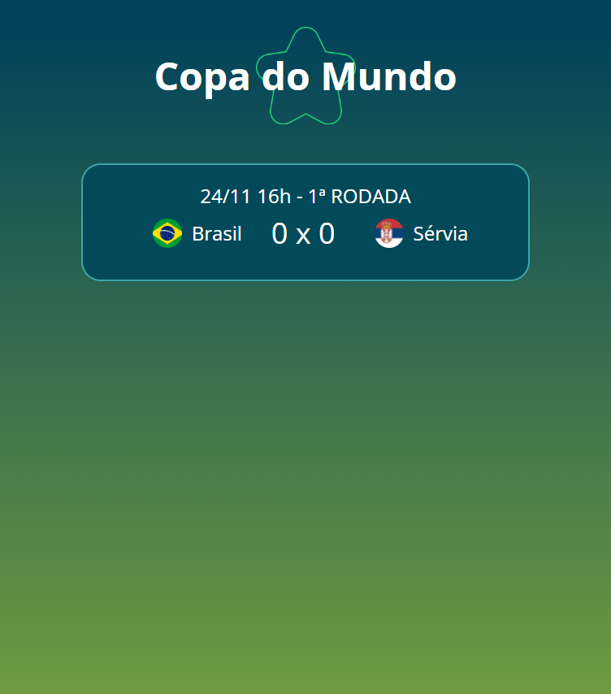

# Aplicação em realtime para acompanhar os jogos da copa!

Aplicação criada para contar os gols em tempo real utilizando a Cloud Firestore do Firebase (Google). O projeto foi desenvolvido por meio da Live da Dio, consegui obter os conhecimentos referentes as tecnologias de Front-End utilizadas, e assim criei o meu modelo. É possível colocar essa aplicação para rodar junto com um jogo de futebol que está acontecendo no momento.

### Vídeo da página:

### Preview da página:

[🔗 Clique aqui para acessar](https://ramonbarret.github.io/copa_RealTime_dio/)

## 🛠 Tecnologias

- HTML5
- CSS3
- JavaScript
- Firebase
- Git e Github

## 📲 Contato

Email: ramon_barreto_medrado@hotmail.com